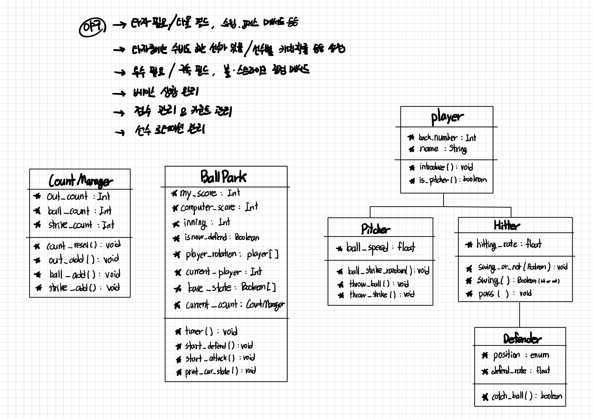

# Week1 과제 명 : CLI 프로그램 제작

## 과제 목차

1. 프로그램 클래스 설계도(다이어그램) 작성하기 
    - 속성, 메서드, 상속의 관계 정의 
    - 2차 상속은 최소 하나 포함
2. 간단한 스레드 구현 (예: 시간 흐름, 날씨 변화, 음악 플레이 등)
3. 스레드간 상호작용할 수 있는 기능 구현 (예 : 사람 스레드와 몹 스레드가 싸워서 사람스레드의 체력이 줄어듬)

## 과제 진행 상황
- [x]  1번 : 프로그램 클래스 다이어그램 작성
- [ ]  2번 : 간단한 스레드 구현
- [ ]  3번 : 스레드간 상호작용할 수 있는 기능 구현

---

<aside>

## 목표 CLI 프로그램 : 미니 야구 게임

사용자가 직접 타자, 수비수를 컨트롤하여 간단한 야구게임을 시뮬레이션할 수 있는 프로그램입니다.

```text
- 사용자는 공격, 수비 턴을 번갈아가며 총 9회의 야구게임에 참여할 수 있다.
- 공격턴에 사용자는 타자를 컨트롤 할 수 있다.
    - swing 할지, 넘어갈지 고른다.
        - swing 했을 시 :
          투수가 strike을 던졌다면 타율에 따라 타구여부 결정됨
          투수가 ball을 던졌다면 strike count +1
        - pass 했을 시 :
          투수가 strike을 던졌다면 strike count +1
          투수가 ball을 던졌다면 ball count +1
    - 안타라면, 무조건 타자는 출루하고 모든 베이스의 주자가 +1 씩 진루한다.
- 수비턴에 사용자는 수비수를 컨트롤 할 수 있다.
    1. 투수가 볼을 던질 지 스트라이크를 던질 지 고른다.
    2. 만약 안타일 시, 어떤 수비수를 활성화 할 지 고른다.
       (외야수 3명, 내야수 4명 중 총 3명 활성화 가능)
        - 타자가 날린 공은 7명의 포지션으로 랜덤하게 떨어진다.
        - 활성화한 수비수에게 공이 떨어질 시, 수비수의 방어율에 따라 out count +1 일지 안타일지 결정된다.
- 메인 클래스 (BallPark class)에 현재 경기상황 : 점수현황, 아웃카운트 현황, 현재 타자 순서 등등이 기록된다.
- 경기 종료 시 사용자가 낸 점수가, 상대(컴퓨터)가 낸 점수보다 높을 시 승리한다.
```

### 1. 프로그램 클래스 다이어그램 작성 (✅완료)



- 모든 선수 관리를 위한 등번호, 이름 필드가 필요함

  👉 **“player” 클래스 필요**
- 사용자가 컨트롤할 수 있는 선수 중에는 타자가 있고, 투수가 있음.

  👉 **“player” 클래스를 상속하는 Pitcher 클래스, Hitter 클래스 필요**
- 타자중에 일부는 수비도 해야하는 선수가 있음.

  👉 **Hitter 클래스를 상속하는 Defender 클래스 필요 (2차 상속)**
- 현재 베이스 상황 관리 / 점수 관리 / 카운트 관리 / 선수 로테이션을 관리할 “게임 관리” 클래스가 필요함.

  👉 **BallPark라는 이름의 메인 클래스에서 관리**

  👉 **아웃, 볼, 스트라이크 카운트를 한번에 관리해야 하므로 CountManager 클래스를 따로 정의**


### 2. 간단한 스레드 구현 (🤔구상중)
아래 3개 스레드 후보 중에 일부 구현 구상중
* 투수 투구 시간 제한을 위한 타이머 스레드 
* 백그라운드 음악 재생 스레드 (선수 응원곡 등)
* 점수 managing 스레드

### 3. 스레드간 상호작용 기능 구현 (🤔구상중)

투수 투구 시간 제한 초과 시, 사용자 스레드에서 투구를 못하고 다음 이닝으로 넘어가는 기능

이 때, 메인 점수 및 카운트 관리 스레드도 업데이트 되어야 함.